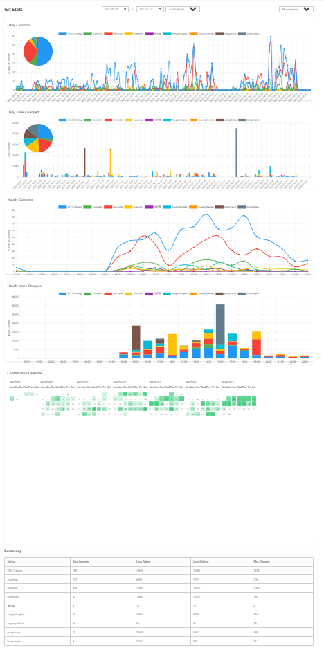

# Git Stats - VS Code Extension

An elegant VS Code extension for visualizing team code contributions. Through interactive charts and an intuitive interface, it helps understand team members' work in real-time.

## Usage

Click the Git Stats icon in VS Code status bar to open the statistics interface.

## Features

### Core Features
- Interactive pie charts showing contribution distribution
- Time series line charts displaying commit trends
- Hourly commits/lines distribution charts
- Author activity heatmap (day × hour grid)
- Commit message word frequency analysis (with Chinese tokenization)
- Code ownership by directory and file (primary author + ownership %)
- Commit streaks tracking (current & longest per author)
- File change leaderboard (top 100 files by commits)
- Draggable and resizable chart containers
- Real-time data updates

### Health Check
- High-risk file ranking by bug density (fix/bug/hotfix/revert commits mapped to the files they touched)
- Source/test change synchronisation rate, plus the frequently changed files that need tests most
- Bot account detection (dependabot, renovate, CI users) and `.mailmap`-aware author identity
- Health report CSV export

### Multi-repo & Filtering
- Multi-repo workspace support with repo and branch dropdown selectors
- Cross-repo statistics merging
- Developer filter across all charts and tables
- Flexible time range selection:
  - Auto range (full history)
  - Last week / month / 3 months / 6 months / year / 3 years
  - Custom date picker

### Export
- CSV export for summary, file stats and health report tables
- PNG export for any chart

## Installation

1. Install from VS Code Marketplace
2. Open any Git repository in VS Code
3. Click the `Git Stats` icon in the status bar to start

## Key Features

- Modern and clean interface design
- Responsive interactive charts
- Real-time data updates
- Efficient memory usage
- Smooth animation transitions

## Use Cases

Particularly suitable for:
- Team leaders tracking project progress
- Code review planning and management
- Sprint retrospectives and planning
- Understanding team work patterns
- Identifying contribution patterns

## Tech Stack

- TypeScript
- VS Code Extension API
- Chart.js (Data Visualization)
- Simple Git (Git Operations)
- Moment.js (Date Processing)

## Contributing

Issues and Pull Requests are welcome! Let's make this extension better together.

## License

Apache-2.0 license

## Support

If you encounter any issues or have suggestions, please submit an Issue on our [GitHub repository](https://github.com/zhuchiheng/git.stats/issues).

[简体中文](README_CN.md)
