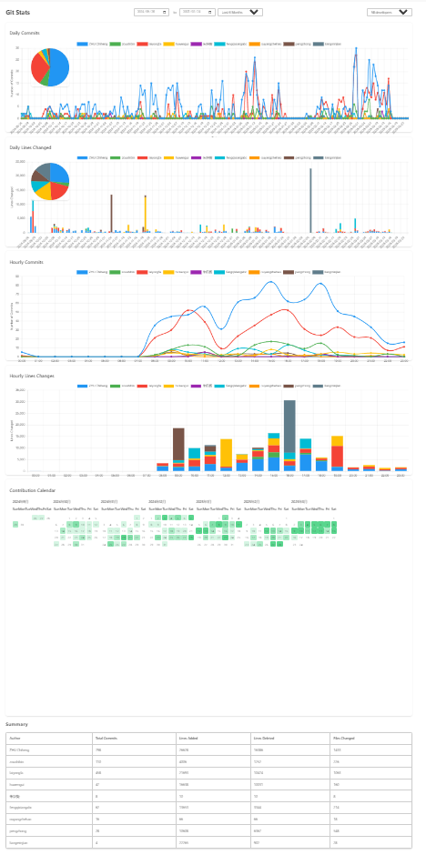

# Git Stats - VS Code 扩展

一个优雅的 VS Code 扩展，用于可视化团队代码贡献情况。通过交互式图表和直观的界面，帮助了解团队成员的工作情况。

## 使用方式

点击 VS Code 状态栏中的 Git Stats 图标即可打开统计界面。

## 功能特点

### 核心功能
- 交互式饼图展示贡献分布
- 时间序列折线图展示提交趋势
- 可拖拽和调整大小的图表容器
- 实时数据更新

### 统计指标
- 每位作者的提交次数
- 代码行数变更（增加/删除）
- 文件修改数量统计
- 团队整体贡献分析

### 可视化功能
- 提交分布饼图
- 代码行数变更分布饼图
- 详细的悬浮提示（包含百分比和具体数值）
- 灵活的时间范围选择：
  - 最近一周
  - 最近一月
  - 最近三月
  - 最近半年
  - 最近一年

## 安装方法

1. 从 VS Code 插件市场安装
2. 在 VS Code 中打开任意 Git 仓库
3. 点击状态栏中的 Git Stats 图标即可开始使用

## 主要特性

- 现代简洁的界面设计
- 响应式交互图表
- 实时数据更新
- 高效的内存使用
- 流畅的动画过渡效果

## 使用场景

特别适用于：
- 团队领导跟踪项目进展
- 代码评审规划和管理
- Sprint 回顾和计划
- 了解团队工作模式
- 识别贡献模式

## 技术栈

- TypeScript
- VS Code 扩展 API
- Chart.js（数据可视化）
- Simple Git（Git 操作）
- Moment.js（日期处理）

## 参与贡献

欢迎提交 Issue 和 Pull Request！让我们一起把这个扩展做得更好。

## 开源协议

Apache-2.0 license

## 支持

如果遇到任何问题或有建议，请在我们的 [GitHub 仓库](https://github.com/lixianmin/git.stats/issues) 提交 Issue。
